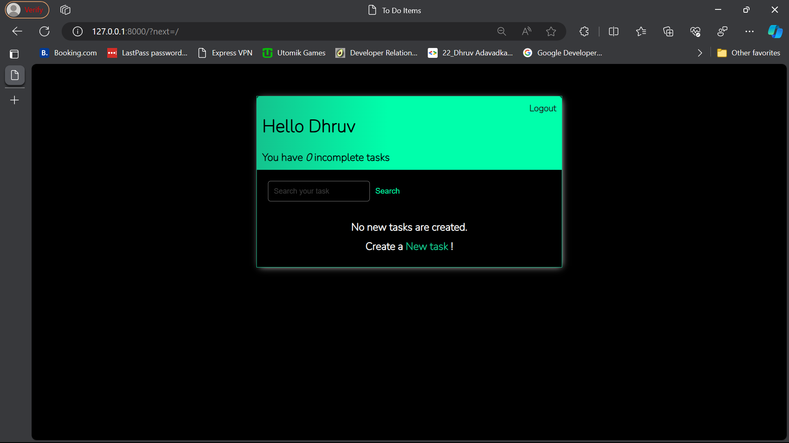
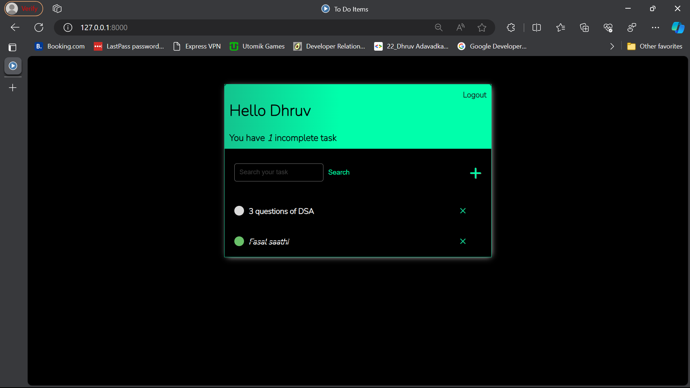
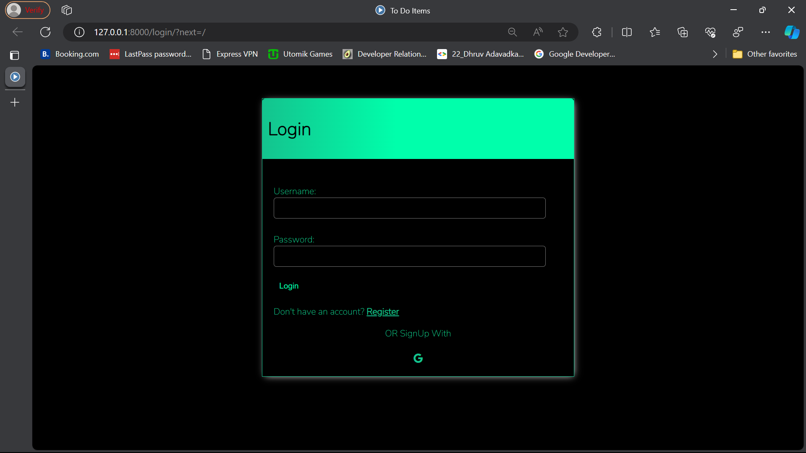

# Django To-Do Web Application


## Overview

This Django To-Do Web Application is a simple task management system that allows users to create, view, update, and delete tasks. It includes user authentication, a responsive interface, and integration with Google OAuth for user registration and login.

## Features

- **User Authentication:** Users can register, log in, and log out securely.
- **Task Management:** Create, update, and delete tasks easily.
- **Task Listing:** View a list of tasks, with the ability to filter by completion status.
- **Detailed Task View:** See detailed information about each task.
- **Password Reset:** Users can reset their passwords through the application.

## Screenshots

Include screenshots of the key features to provide a visual representation of your project.

1. **Task List:**
   

2. **Task Detail:**
   

3. **Login Page:**
   

## Prerequisites

- Python 3.x
- Django 4.0.1
- Additional dependencies listed in `requirements.txt`

## Installation

1. **Clone the repository:**

   ```bash
   git clone https://github.com/your-username/django-todo.git

2. **Apply migrations:**

   ```bash
      python manage.py migrate

3. **Run the development server:**


   ```bash
      python manage.py runserver
   
3. **Open the application in your browser:**

http://localhost:8000/

## Configuration
### Database:
The default configuration uses SQLite. For production, consider using a more robust database like PostgreSQL.

### Google OAuth:
Configure your Google OAuth credentials in the Django settings.

## Usage
Register a new account or log in using Google OAuth.
Start managing your tasks!

## Contributing
If you'd like to contribute to this project, please follow our Contribution Guidelines.

## License
This project is licensed under the MIT License.

## Acknowledgments
Special thanks to Django for the web framework.
Icons used in the project are from FontAwesome.
